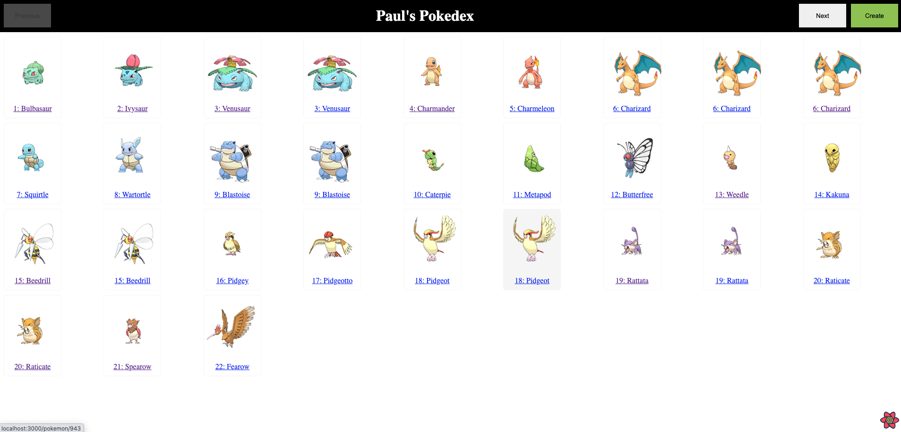
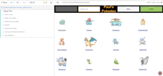

## Paul's Pokedex

To run locally:

- clone repo and cd to root folder
- `cd backend`
- `python manage.py seed`
- `python manage.py runserver`
- Open another terminal at root folder
- `cd frontend`
- `yarn`
- `yarn start`

App should automatically open at `http://localhost:3000` and show first page of
pokedex:

To run Cypress tests:

- Open another terminal and cd to root folder
- `cd frontend`
- `yarn cypress:open`

This will launch a set of end-to-end tests that automatically test the app is
working correctly:

### Features

- [x] Full CRUD support for managing Pokedex
- [x] Simulates different user groups (User and Admin) to demonstrate client
      state management using built-in React **state management** support.
- [x] Full support for **Search** and **Pagination**
- [x] Client state management using built-in React
- [x] Frontend **end to end tests** using Cypress
- [x] React query for intelligent **data fetching and caching**

### Todo

- [ ] Add more pokemon details - only name, national number and image supported
      so far.
- [ ] Improve styling - only basic styling included currently to demo use of
      styled-components.
- [ ] Add production build using Docker (currently only works in dev mode)
- [ ] Add Authenticaion
- [ ] Better seed data to avoid duplicate pokemon / missing images
- [ ] Validation (for example, preventing duplicate national numbers)
- [ ] Add backend integration tests
- [ ] Add backend unit tests
- [ ] Container support (ability to bring up backend and frontend together using
      docker-compose)
- [ ] Improved error handling (for now just using alert and console logging)
- [ ] Reduce data deps in Cypress tests - current easy for tests to start
      failing if the entire run doesn't complete for whatever reason.
